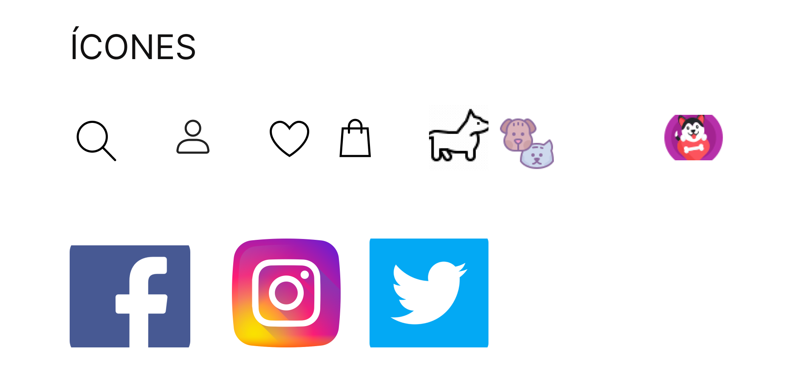
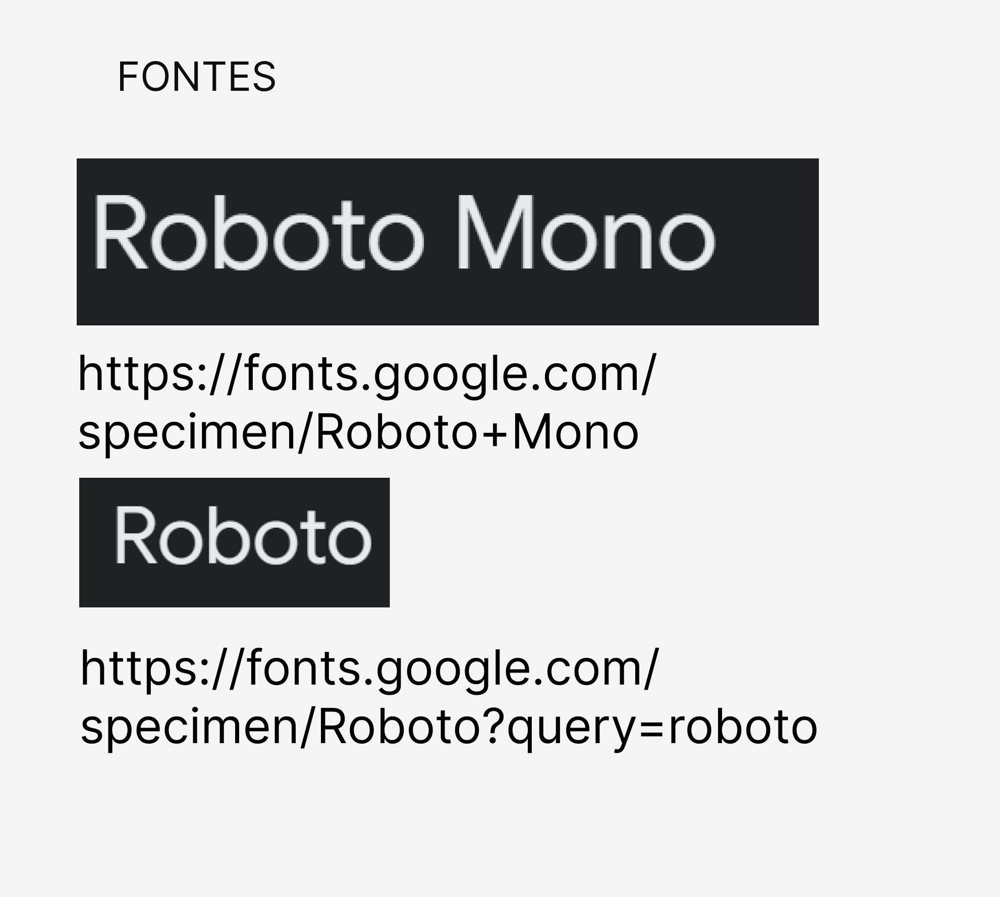

Desafio Paradas 09 e 10 - Tecnologia

Em grupos crie o template do site para o seu cliente, você deverá utilizar imagens, fontes, cores e ícones que combinem com a marca e a logo que vocês criaram na aula anterior.

Exporte o arquivo do figma como png e adicione o arquivo, juntamente com a paleta de cores em um repositório do github.

O template será avaliado da seguinte forma: 
● Estrutura (header, menu, body, footer) 
● cores 
● usabilidade 
● escolha de imagens 
● fontes 

### Abaixo está o style-guide da página !!

